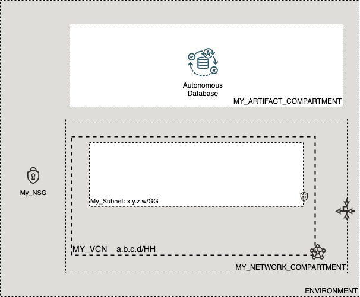

# OCI Cloud Bricks: Autonomous Database

[](https://img.shields.io/badge/license-UPL-green) [](https://sonarcloud.io/dashboard?id=oracle-devrel_terraform-oci-cloudbricks-adb-database)

## Introduction
The following brick contains the logic to provision an ADB in any container of choice. 

## Reference Architecture
The following is the reference architecture associated to this brick



### Prerequisites
- Pre-created Artifact and Network Compartments
- Pre-created VCN and subnet structure
- Pre-created Network Security Group

---

## Sample tfvar file
```shell
########## SAMPLE TFVAR FILE ##########
######################################## COMMON VARIABLES ######################################
region           = "foo-region-1"
tenancy_ocid     = "ocid1.tenancy.oc1..abcdefg"
user_ocid        = "ocid1.user.oc1..aaaaaaabcdefg"
fingerprint      = "fo:oo:ba:ar:ba:ar"
private_key_path = "/absolute/path/to/api/key/your_api_key.pem"
######################################## COMMON VARIABLES ######################################

######################################## ARTIFACT SPECIFIC VARIABLES ######################################
adb_instance_compartment_name = "MY_ARTIFACT_COMPARTMENT"
adb_network_compartment_name  = "MY_NETWORK_COMPARTMENT"
vcn_display_name              = "MY_VCN"
network_subnet_name           = "My_Subnet"
adb_nsg_name                  = "My_NSG"
adb_workload                  = "OLTP"
database_version              = "19c"
cpu_core_count                = "1"
data_storage_size_in_tbs      = "1"
db_name                       = "ADBTEST"
display_name                  = "adbname"
private_endpoint_label        = "adbname"
license_model                 = "BRING_YOUR_OWN_LICENSE"
is_auto_scaling_enabled       = true
is_data_guard_enabled         = false
is_dedicated                  = false
######################################## ARTIFACT SPECIFIC VARIABLES ######################################
########## SAMPLE TFVAR FILE ##########
```

### Variable specific considerations
- Variable `license_model` can have the following options: 
  - `BRING_YOUR_OWN_LICENSE`
  - `LICENSE_INCLUDED`
- Variable `adb_workload` can be representing the following options: 
  - `OLTP` - indicates an Autonomous Transaction Processing database
  - `DW` - indicates an Autonomous Data Warehouse database
  - `AJD` - indicates an Autonomous JSON Database
  - `APEX` - indicates an Autonomous Database with the Oracle APEX Application Development workload type. 
    - *Note 1*: db_workload can only be updated from AJD to OLTP or from a free OLTP to AJD.
    - *Note 2*: `APEX` workflowd only supports `LICENSE_INCLUDED` License Model
- Variable `database_version` should grab any of the supported ones mentioned on the [following link](https://docs.oracle.com/en-us/iaas/Content/Database/Concepts/adboverview.htm#older_db_versions)
- Variables `db_name` must begin with an alphabetic character and can contain a maximum of 14 alphanumeric characters. Special characters are not permitted. The database name must be unique in the tenancy
- Keep variables `display_name` and `private_endpoint_label`with the same name


### Sample provider
The following is the base provider definition to be used with this module

```shell
terraform {
  required_version = ">= 0.13.5"
}
provider "oci" {
  region       = var.region
  tenancy_ocid = var.tenancy_ocid
  user_ocid        = var.user_ocid
  fingerprint      = var.fingerprint
  private_key_path = var.private_key_path
  disable_auto_retries = "true"
}

provider "oci" {
  alias        = "home"
  region       = data.oci_identity_region_subscriptions.home_region_subscriptions.region_subscriptions[0].region_name
  tenancy_ocid = var.tenancy_ocid  
  user_ocid        = var.user_ocid
  fingerprint      = var.fingerprint
  private_key_path = var.private_key_path
  disable_auto_retries = "true"
}
```

## Variable documentation
## Requirements

No requirements.

## Providers

| Name | Version |
|------|---------|
| <a name="provider_oci"></a> [oci](#provider\_oci) | n/a |
| <a name="provider_random"></a> [random](#provider\_random) | n/a |

## Modules

No modules.

## Resources

| Name | Type |
|------|------|
| [oci_database_autonomous_database.AutonomousDatabase](https://registry.terraform.io/providers/hashicorp/oci/latest/docs/resources/database_autonomous_database) | resource |
| [random_string.ADBAdminPassword](https://registry.terraform.io/providers/hashicorp/random/latest/docs/resources/string) | resource |
| [oci_core_network_security_groups.NSG](https://registry.terraform.io/providers/hashicorp/oci/latest/docs/data-sources/core_network_security_groups) | data source |
| [oci_core_subnets.SUBNET](https://registry.terraform.io/providers/hashicorp/oci/latest/docs/data-sources/core_subnets) | data source |
| [oci_core_vcns.VCN](https://registry.terraform.io/providers/hashicorp/oci/latest/docs/data-sources/core_vcns) | data source |
| [oci_identity_compartments.COMPARTMENTS](https://registry.terraform.io/providers/hashicorp/oci/latest/docs/data-sources/identity_compartments) | data source |
| [oci_identity_compartments.NWCOMPARTMENTS](https://registry.terraform.io/providers/hashicorp/oci/latest/docs/data-sources/identity_compartments) | data source |

## Inputs

| Name | Description | Type | Default | Required |
|------|-------------|------|---------|:--------:|
| <a name="input_adb_instance_compartment_name"></a> [adb\_instance\_compartment\_name](#input\_adb\_instance\_compartment\_name) | Defines the compartment name where the infrastructure will be created | `string` | `""` | no |
| <a name="input_adb_network_compartment_name"></a> [adb\_network\_compartment\_name](#input\_adb\_network\_compartment\_name) | Defines the compartment where the Network is currently located | `any` | n/a | yes |
| <a name="input_adb_nsg_name"></a> [adb\_nsg\_name](#input\_adb\_nsg\_name) | Display Name of Network Security Group associated with ADB | `any` | n/a | yes |
| <a name="input_adb_workload"></a> [adb\_workload](#input\_adb\_workload) | A filter to return only autonomous database resources that match the specified workload type. Values may vary between OLTP and DW | `string` | `"OLTP"` | no |
| <a name="input_cpu_core_count"></a> [cpu\_core\_count](#input\_cpu\_core\_count) | (Required) (Updatable) The number of OCPU cores to be made available to the database. This input is ignored for Always Free resources. | `string` | `"1"` | no |
| <a name="input_data_storage_size_in_tbs"></a> [data\_storage\_size\_in\_tbs](#input\_data\_storage\_size\_in\_tbs) | (Required) (Updatable) The size, in terabytes, of the data volume that will be created and attached to the database. This storage can later be scaled up if needed. This input is ignored for Always Free resources. | `string` | `"1"` | no |
| <a name="input_database_version"></a> [database\_version](#input\_database\_version) | A valid Oracle Database Version for Autonomous Database | `string` | `"19c"` | no |
| <a name="input_db_name"></a> [db\_name](#input\_db\_name) | (Required) The database name. The name must begin with an alphabetic character and can contain a maximum of 14 alphanumeric characters. Special characters are not permitted. The database name must be unique in the tenancy. | `any` | n/a | yes |
| <a name="input_display_name"></a> [display\_name](#input\_display\_name) | (Optional) (Updatable) The user-friendly name for the Autonomous Database. The name does not have to be unique. | `any` | n/a | yes |
| <a name="input_fingerprint"></a> [fingerprint](#input\_fingerprint) | API Key Fingerprint for user\_ocid derived from public API Key imported in OCI User config | `any` | n/a | yes |
| <a name="input_is_auto_scaling_enabled"></a> [is\_auto\_scaling\_enabled](#input\_is\_auto\_scaling\_enabled) | (Optional) (Updatable) Indicates if auto scaling is enabled for the Autonomous Database OCPU core count. The default value is FALSE. Note that auto scaling is available for databases on shared Exadata infrastructure only. | `string` | `"false"` | no |
| <a name="input_is_data_guard_enabled"></a> [is\_data\_guard\_enabled](#input\_is\_data\_guard\_enabled) | Indicates whether the Autonomous Database has Data Guard enabled. | `bool` | `false` | no |
| <a name="input_is_dedicated"></a> [is\_dedicated](#input\_is\_dedicated) | True if the database is on dedicated Exadata infrastructure. | `bool` | `false` | no |
| <a name="input_license_model"></a> [license\_model](#input\_license\_model) | (Optional) (Updatable) The Oracle license model that applies to the Oracle Autonomous Database. Note that when provisioning an Autonomous Database on dedicated Exadata infrastructure, this attribute must be null because the attribute is already set at the Autonomous Exadata Infrastructure level. When using shared Exadata infrastructure, if a value is not specified, the system will supply the value of BRING\_YOUR\_OWN\_LICENSE. | `any` | `null` | no |
| <a name="input_network_subnet_name"></a> [network\_subnet\_name](#input\_network\_subnet\_name) | Defines the subnet display name where this resource will be created at | `any` | n/a | yes |
| <a name="input_private_endpoint_label"></a> [private\_endpoint\_label](#input\_private\_endpoint\_label) | The private endpoint label for the resource. | `any` | n/a | yes |
| <a name="input_private_key_path"></a> [private\_key\_path](#input\_private\_key\_path) | Private Key Absolute path location where terraform is executed | `any` | n/a | yes |
| <a name="input_region"></a> [region](#input\_region) | Target region where artifacts are going to be created | `any` | n/a | yes |
| <a name="input_tenancy_ocid"></a> [tenancy\_ocid](#input\_tenancy\_ocid) | OCID of tenancy | `any` | n/a | yes |
| <a name="input_user_ocid"></a> [user\_ocid](#input\_user\_ocid) | User OCID in tenancy. Currently hardcoded to user denny.alquinta@oracle.com | `any` | n/a | yes |
| <a name="input_vcn_display_name"></a> [vcn\_display\_name](#input\_vcn\_display\_name) | VCN Display name to execute lookup | `any` | n/a | yes |
| <a name="input_whitelisted_ips"></a> [whitelisted\_ips](#input\_whitelisted\_ips) | (Optional) (Updatable) The client IP access control list (ACL). This feature is available for databases on shared Exadata infrastructure only. Only clients connecting from an IP address included in the ACL may access the Autonomous Database instance. This is an array of CIDR (Classless Inter-Domain Routing) notations for a subnet or VCN OCID. | `list` | `[]` | no |

## Outputs

| Name | Description |
|------|-------------|
| <a name="output_autonomous_database_admin_password"></a> [autonomous\_database\_admin\_password](#output\_autonomous\_database\_admin\_password) | ADB Automated Password |
| <a name="output_autonomous_databases"></a> [autonomous\_databases](#output\_autonomous\_databases) | ADB generated Object |

## Contributing
This project is open source.  Please submit your contributions by forking this repository and submitting a pull request!  Oracle appreciates any contributions that are made by the open source community.

## License
Copyright (c) 2021 Oracle and/or its affiliates.

Licensed under the Universal Permissive License (UPL), Version 1.0.

See [LICENSE](LICENSE) for more details.
